# Tree SHAP analyzer
<figure>
    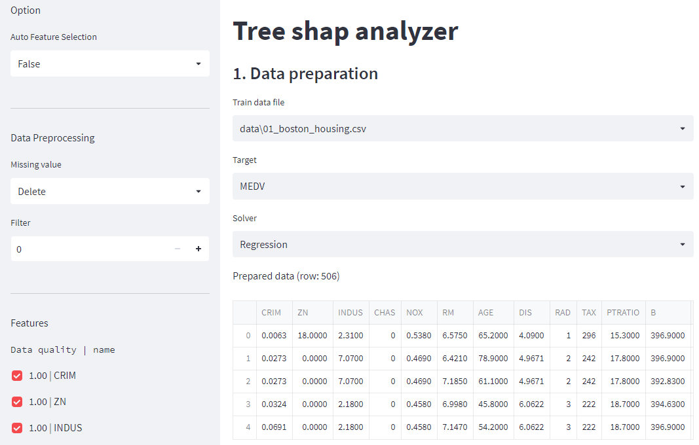  
</figure>  

Tree SHAP analyzer is web app data analyzer. Our goal is to democratize data analysis for those who are not familiar with writing code. It includes data preprocessing, model selection, model optimization, and prediction. Please check the details for the SHAP (https://github.com/slundberg/shap).

# How to run
To start this app, run the `main.py` according to the script below.  

```python
streamlit run main.py
```

# How to use
This app has five sections which are `data preparation`, `evaluation`, `feature importance`, `feature dependence` and `prediction`.  

## 1. Data preparation
- **Train data file**: Select the data file to use for the analysis.
  <details>
    <summary>example</summary>
    <figure>
        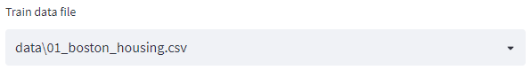  
    </figure>  
  </details>  

- **Data preprocessing**: This app provides some simple data preprocessing.  
    - **Missing Value**: Select treatment method for missing values in the train data.
      <details>
        <summary>example</summary> 
        <figure>
            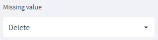
        </figure>
      </details>  

      - **Delete**: Delete the row containing the missing values.
      - **Replace**: Replace with any value in the same column.  

    - **Filter**: Filter is the process of choosing a specific subset of the train data.
      - **Filter Number**: Select number of columns to apply filter.
        <details>
          <summary>example</summary> 
          <figure>
              
          </figure>  

      - **Select values**: Select values for the filtered column.
        - **Numeric data**: You can select data range with the slider.
          <details>
            <summary>example</summary> 
            <figure>
                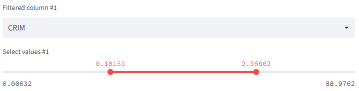  
            </figure> 
          </details>

        - **Categorical data**: You can select specific data with the multiselect.
          <details>
            <summary>example</summary> 
            <figure>
                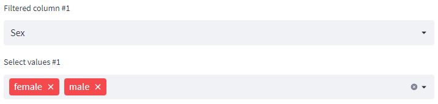  
            </figure> 
          </details>  

    - **Feature selection**: Select features using the check boxes to apply to the analysis. Data quality shows usable data ratio (except NaN data). `1.0` means all data is avaliable. Please check about `random_noise` in the `Auto Feature Selection` section.
      <details>
        <summary>example</summary> 
        <figure>
            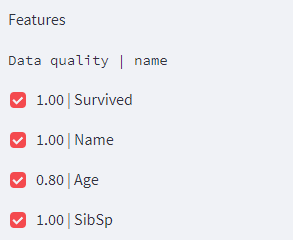  
        </figure>
      </details>  

    - **Target / Solver**: Select a target column and a solver.
      - **Regression**: `Regression` solver solves regression problems. It uses models as `LGBMRegressor`, `XGBRegressor`, `RandomForestRegressor` and `ExtraTreesRegressor`.
        <details>
          <summary>example</summary>
          <figure>
              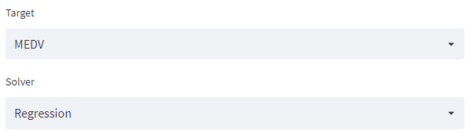  
          </figure>  
        </details>

      - **Binary Classification**: `Binary Classification` solver solves classification problems. It uses models as `LGBMClassifier`, `XGBClassifier`, `RandomForestClassifier` and `ExtraTreesClassifier`.  Here, the target needs to be encoded. Set a percentage to separate the target by 0 and 1.
        <details>
          <summary>example</summary>
          <figure>
              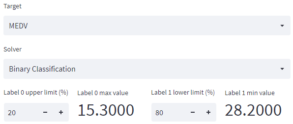  
          </figure>  
        </details>  

    - **Check dataset**: You can check the prepared data set in real time.
      <details>
        <summary>example</summary>
        <figure>
            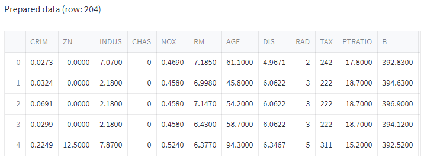
        </figure>  
      </details>

## 2. Evaluation
When you click `Start` button, the app train four models and select the best automatically. For the regression models, the minimum `mae` (mean average error) model is selected. For the classification models, the maximum `auc` (area under the curve) model is selected. It provides visualization of prediction results and answers.  

|Regression|Binary Calssification|
|:---:|:---:|
|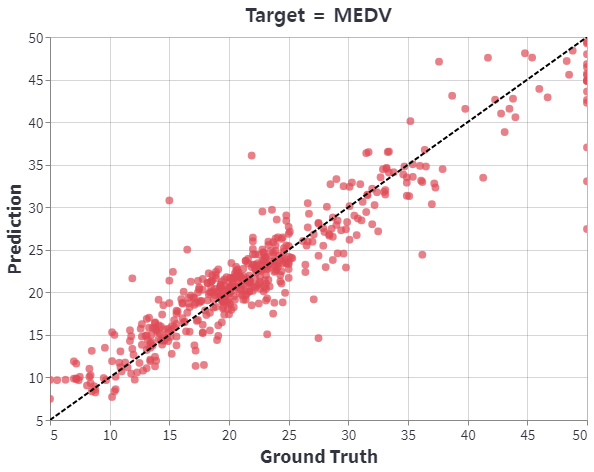|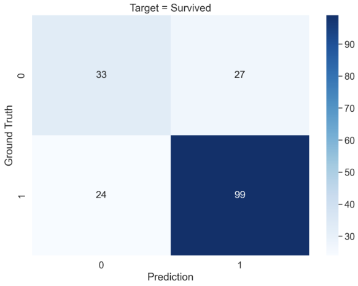|

## 3. Feature importance
In this section, you can see feature imporance of the best model. You can choose the number of features in the graph with the number input. When you click the `Download` button, you can download the feature importance data as a `csv` file.
<figure>
    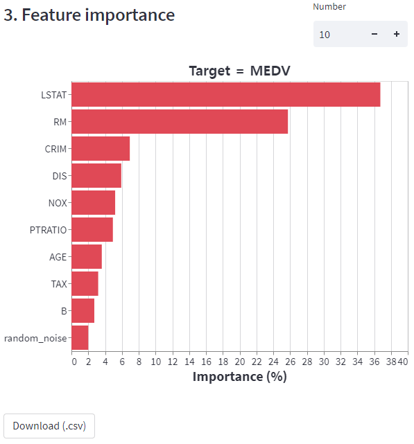  
</figure> 

## 4. Feature dependence
- **SHAP**: SHAP dependence plot. SHAP means the contribution of features to predict the target. Please refer to the link below for more information on SHAP.
  - https://github.com/slundberg/shap
  - https://christophm.github.io/interpretable-ml-book/shap.html  
- **1D Simulation**: 1D simulation dependence plot. This shows the change in the target value for the selected feature. Other features are setted as mean value.
- **2D Simulation**: 2D simulation dependence plot. This shows the change in the target value for two selected features. Other features are setted as mean value.

|SHAP|1D simulation|2D simulation|
|:---:|:---:|:---:|
|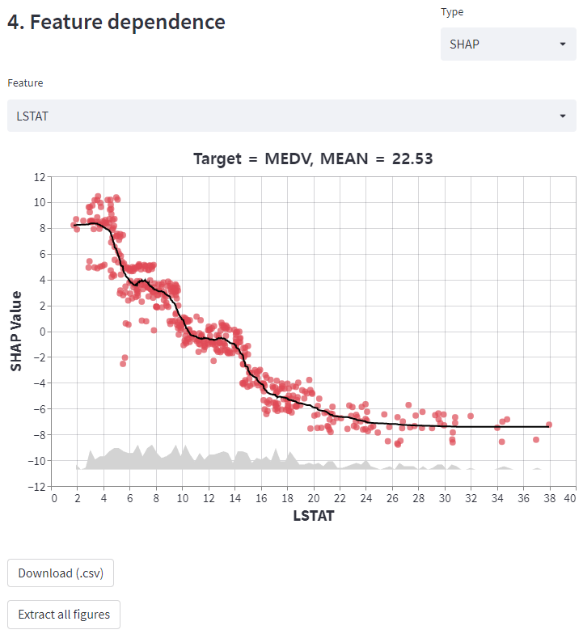|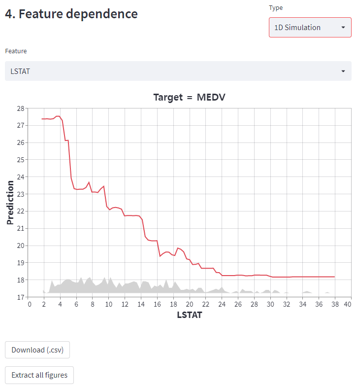|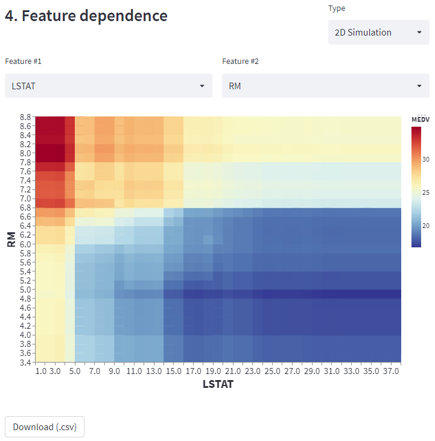|

## 5. Prediction
You can make predictions about the test data. The test data should include features used for model training.
  
## 6. Optional
- **Auto feature selection**: `Auto feature selection` is an option to remove unimportant features automatically. Technically, it removes features whose importance lower than `random_noise`. `random_noise` is a feature that has random uniform distribution. Features with smaller `random_noise` importance can be considered insignificant.

# Reference
1. SHAP: https://github.com/slundberg/shap
2. Titanic dataset: https://www.kaggle.com/c/titanic
3. Boston house dataset: https://www.cs.toronto.edu/~delve/data/boston/bostonDetail.html
